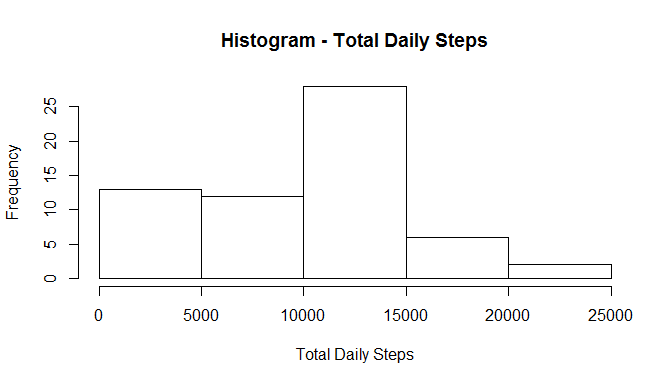
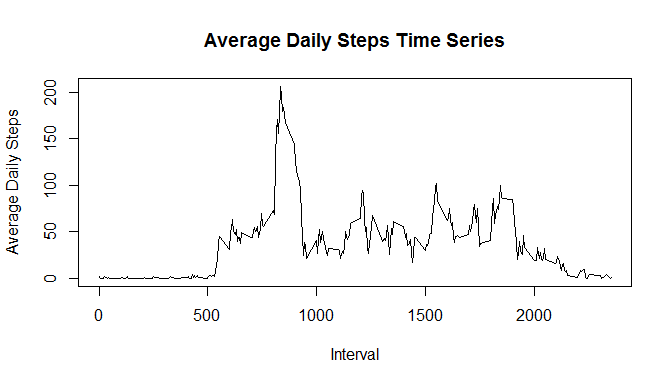
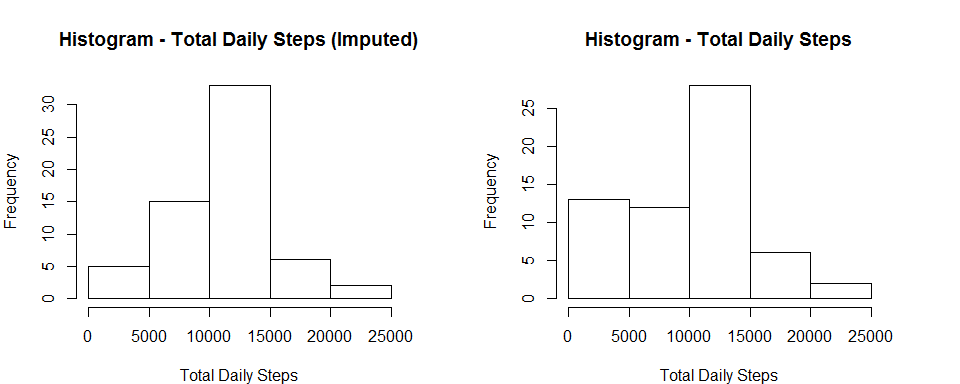
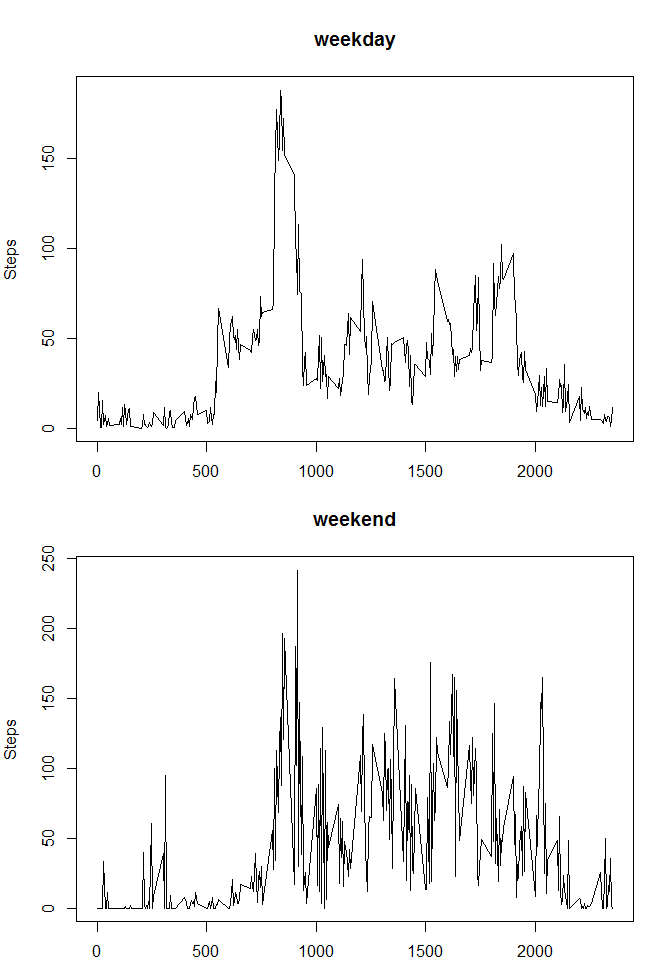

# Reproducible Research: Peer Assessment 1


## Loading and preprocessing the data
First I unzip the data using the unzip function. Then load the activity data from your current working directory using read.csv. The data will be assigned to variable activity.data.


```r
unzip("./activity.zip")
activity.data <- read.csv("./activity.csv", colClasses = c("numeric", "character", "numeric"))
```

Then I change the date to the Posixlt format for ease of use later in the analysis.


```r
unzip("./activity.zip")
activity.data$date <- as.POSIXlt(activity.data$date)
```

## What is mean total number of steps taken per day?
In order to determine the sum of steps each day I use the tapply function and assign it to sum.day.


```r
sum.day <- tapply(activity.data$steps, as.POSIXct(activity.data$date), sum, na.rm = TRUE)
```

Now I will generate the histogram to show the distribution of total daily steps.


```r
hist(sum.day, main = "Histogram - Total Daily Steps", xlab = "Total Daily Steps")
```

 


```r
sum.mean <- mean(sum.day)
sum.median <- median(sum.day)
```

The mean of total daily steps is: 9354.2295082, and the median is: 1.0395\times 10^{4}.

## What is the average daily activity pattern?
I will now generate the average daily steps for each 5 minute interval.


```r
sum.interval <- tapply(activity.data$steps, activity.data$interval, mean, na.rm = TRUE)
```

This is a time series of the results from the above computation.


```r
plot(names(sum.interval), sum.interval, type = "l", xlab = "Interval", ylab = "Average Daily Steps", main = "Average Daily Steps Time Series")
```

 


```r
max.interval <- max(sum.interval)
position <- which(max.interval == sum.interval)
interval.max <- as.numeric(names(sum.interval[position]))
```
There is an interesting peak in the time series. Let's see what the value is, and for which interval it is.  

The value at position 104 is  206.1698113 for interval 835.

## Imputing missing values
I saw some missing values in the dataset. All of the previous calculations have removed the NAs. That might distort the analysis. Now I will update the NAs to allow for a more robust analysis.  


```r
missing.count <- sum(is.na(activity.data))
```

First, I calculate the number of missing values to be 2304. I impute a value for each them, that is a fancy way of saying I will give them a value. This is done by way of random sampling from the non-missing values. Note I am imputing the data into another variable, so that I can have my original dataset preserved for reference.


```r
activity.impute <- activity.data
activity.impute$steps[is.na(activity.impute$steps)] <- sample(activity.impute$steps[!is.na(activity.impute$steps)], missing.count, replace = TRUE)
```

I revisit an earlier analysis to compare the impute data set to the original. The histogram of total daily steps will do nicely for comparison. Using the same steps from above I arrive at the below 2 histograms for imputed and not data.


```r
sum.day.impute <- tapply(activity.impute$steps, as.POSIXct(activity.impute$date), sum)
```


```r
par(mfrow = c(1,2), mar = c(4,4,4,4))
hist(sum.day.impute, main = "Histogram - Total Daily Steps (Imputed)", xlab = "Total Daily Steps")

hist(sum.day, main = "Histogram - Total Daily Steps", xlab = "Total Daily Steps")
```

 


```r
sum.mean.impute <- mean(sum.day.impute)
sum.median.impute <- median(sum.day.impute)
mean.difference <- abs(sum.mean - sum.mean.impute)
median.difference <- abs(sum.median - sum.median.impute)
difference.text <- if(mean.difference > 0 || median.difference > 0) { "There is a difference in center between the original and imputed datasets. Imputing normalizes the dataset."} else {"WOW! There is no difference in the center between the original and imputed datasets. Imputing doesn't change anything."}
```

The means are 1446.9016393 steps apart, and the medians are 620 steps apart. There is a difference in center between the original and imputed datasets. Imputing normalizes the dataset..


## Are there differences in activity patterns between weekdays and weekends?
I create a factor variable weekend in the activity.impute dataset. This variable is then populated based on the values in the date variable for the same dataset.


```r
activity.impute$weekend <- factor(x = NA, levels = c("weekday", "weekend"), ordered = FALSE)
activity.impute$weekend[which(activity.impute$date$wday == c(0,6))] <- "weekend"
activity.impute$weekend[which(activity.impute$date$wday != c(0,6))] <- "weekday"
```

Now, I create a panel plot of the weekday and weekend average daily steps by interval.

```r
par(mfrow = c(2,1), mar = c(2,4,4,2))
weekday.interval <- tapply(activity.impute$steps, list(activity.impute$interval,activity.impute$weekend), mean)
plot(rownames(weekday.interval), weekday.interval[,1], xlab = "Interval", main = "weekday", type = "l", ylab = "Steps")
plot(rownames(weekday.interval), weekday.interval[,2], xlab = "Interval", main = "weekend", type = "l", ylab = "Steps")
```

 

It appears there are more steps taken on the weekends than weekdays. Why is that I wonder? This will require more analysis!
